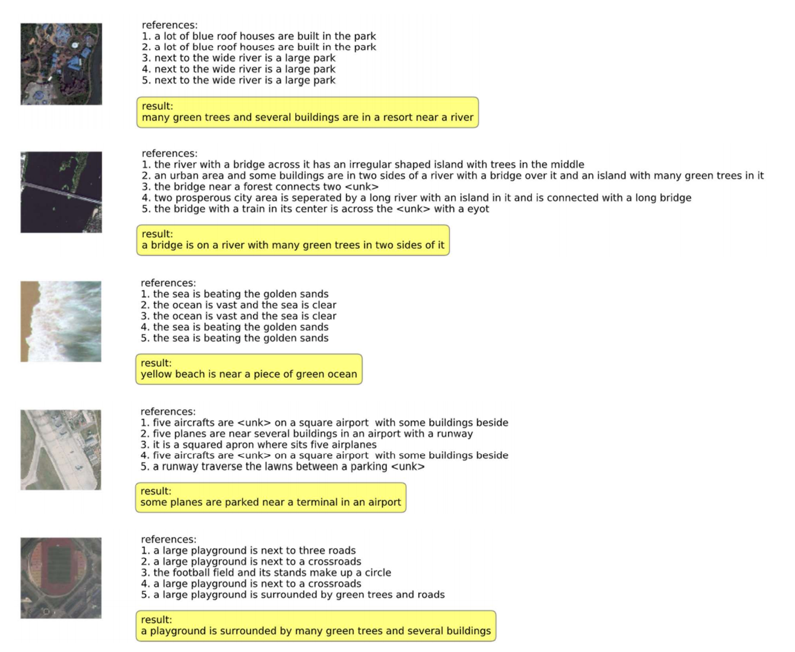

# 

## Abstract

This paper proposes a new model combined with 
semantic segmentation for remote sensing image caption. The model is based on Fully 
Convolutional Network (FCN) and uses it to generate textual descriptions of remote sensing 
images. The paper also discusses effect of FCN on the traditional image caption model based 
on attention mechanism. Finally, this paper attempts to integrate the multiple descriptions 
of an remote sensing image based on the unsupervised text summary model, making the 
final description more comprehensive, diverse and accurate. Experimental results prove the 
effectiveness of the proposed model. Compared with several other image caption methods 
based on the attention mechanism and Convolutional Neural Network (CNN), our method 
has achieved a higher score in the evaluation of various indicators on the RSICD (Remote 
Sensing Image Caption Dataset). The score indicates that the proposed model has better 
semantic description performance in remote sensing images. 

## Result

## Conclusion

We propose a novel method of combining bottom-up and top-down attention, which allows attention to be calculated more naturally at the level of objects and other salient regions. By applying this method to image description and visual response tasks, we have achieved state-of-the-art results in both areas, while improving the interpretability of the attention weights obtained. At a high level, our work more closely integrates the tasks related to vision and language understanding with the latest developments in object detection. This work further indicates some future research directions. At the same time, a more direct benefit is that the pre-trained CNN features can be replaced with pre-trained bottom-up attention features, so that the model can perform better.